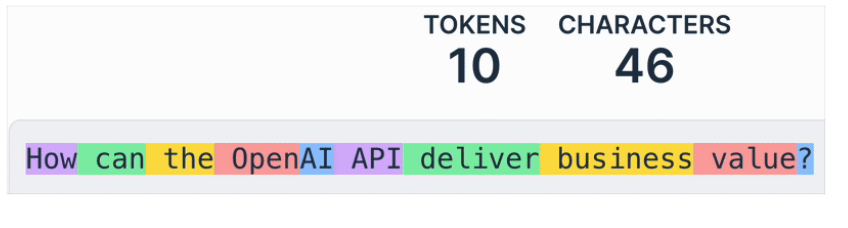

## working with OpenAI API
    - basic request format:
```Python
    from openai import OpenAI

    client = OpenAI(api_key="ENTER KEY HERE")
    
    response = client.chat.completions.create(
    model="gpt-4o-mini",
    max_completion_tokens=100,
  
    # Enter your prompt
    messages=[{"role": "user", "content": "INSERT YOUR PROMPT HERE"}]
)

print(response.choices[0].message.content)
```

## Summarizing and editing text

### Text editing
```Python
prompt = """
upate name to Ragnar, pronouns to lord/master, and job title to Senior Dragon Slayer in the following text:

Joanne is a content developer at datacamp. Her favorite programming language is R, which she uses for statistical analysis.
"""

response = client.chat.completions.create(
    model = 'gpt-4o-mini',
    messages = [{'role': 'user', 'content': prompt}]
)

print(response.choices[0].message.content)
```
### Text Summarization
```Python
text = """
Customer: Hi, I'm trying to log into my account, but it keeps saying my password is incorrect. I'm sure I'm entering the right one.

Support: I'm sorry to hear that! Have you tried resetting your password?
...
"""

prompt = f"""Summarize the customer support chat in three concise key point: {text}"""
```

### Calculating cost of using the API
    - charged by token.
    - tokens are the individual units that the prompt is made of
    - 
```Python
# define price per token
input_token_price = 0.15 / 1_000_000   # tokens sold by the million
output_token_price = 0.6 / 1_000_000

# extract token usage
input_tokens = response.usage.prompt_tokens
output_tokens = max_completion_tokens

# calculate cost
cost = (input_tokens * input_token_price + output_tokens * output_token_price)

print(f"estimated cost: ${cost}")
```

### Text Generation
